# PROBLEMA DE NEGOCIO

Analisar os dados de uma cafeteria para entender como esta a saúde financeira do negócio e propor insights estratégicos para alavancar o faturamento e encontrar pontos de melhoria

# PREMISSAS DA ANÁLISE

Foram analisados dados históricos de transações de vendas de Janeiro a Junho de 2023 das 3 lojas da rede

# CONTEXTO

Sr. Oliveira fundou o Aroma Café há dez anos, quando percebeu uma lacuna no mercado local por cafeterias de alta qualidade, onde as pessoas pudessem se reunir para desfrutar de uma xícara de café excepcional em um ambiente acolhedor. O negócio cresceu rapidamente, e agora eles têm várias lojas espalhadas pela cidade.
 Uma dessas lojas, localizada no centro da cidade, tem sido uma fonte constante de orgulho para Sr. Oliveira. Ele investiu não apenas dinheiro, mas também tempo e energia na construção de uma comunidade em torno dela. Eles têm uma clientela fiel que visita diariamente e uma equipe dedicada que compartilha sua paixão pelo café e pelo serviço excepcional.
 No entanto, nos últimos meses, Sr. Oliveira tem notado algumas flutuações nos números de vendas e no fluxo de clientes. Ele está preocupado que a operação da loja possa estar enfrentando desafios que ele não percebeu.
 Para entender melhor a situação, Sr. Oliveira decide realizar uma análise detalhada da operação das lojas, ou seja, da rede de cafeterias. Ele começa revisando os registros de vendas, comparando os números mensais e semanais para identificar quaisquer tendências.
 Com base em sua análise, Sr. Oliveira identifica algumas áreas-chave que precisam de atenção. Parece que o aumento da concorrência de novas cafeterias na área pode estar afetando o tráfego de clientes. Além disso, alguns clientes expressaram preocupações sobre os preços dos produtos e a consistência do serviço durante os horários de pico.

 Contudo, Sr. Oliveira não está completamente convencido dos resultados que suas análises mostraram, ele gostaria de uma opinião profissional de um analista de dados. Por esse motivo, você foi contratado para responder a seguinte sequência de perguntas: 

### PERGUNTAS

1.Como está a saúde da rede de cafeterias, no geral? Elas estão indo bem ou mal?

2.Existe algum motivo do porque a rede está indo bem ou mal? Você poderia me explicar o que está causando uma boa ou má saúde do negócio?

3.Você poderia prever o faturamento da rede de cafeteria nos próximos 30 dias?

4.Quais são as suas recomendações para alavancar ainda mais o negócio, caso ele esteja indo bem ou reverter uma situação ruim, caso ele esteja indo mal?

# ESTRATEGIA DA SOLUÇAO
	
#### Passo 1: Definir as métricas
#### Passo 2: Definição da coluna fato
#### Passo 3: Identificação das dimensões
#### Passo 4: Levantar as Hipóteses para responder a pergunta de negócio
#### Passo 5: Priorização das hipóteses 
  - Verificar os dados disponíveis
  - Insights acionáveis 
#### Passo 6: Dividir a analise em 4 partes ( Análise Descritiva, Análise Diagnóstica, Análise Preditiva e Análise Prescritiva) 
#### Passo 7: Montar um protótipo de visualização para cada análise
#### Passo 8: Definir as ferramentas - Google Sheets, Tabela Dinâmica, Gráficos para visualização e XLminer Analysis toolPack (Ferramenta Estatística) 

# HIPOTESES ANALISADAS
 ### 1. Análise Descritiva
- Qual o faturamento por Mês?
- Qual o faturamento por Dia?
- Qual o faturamento por Semana?
- Qual o faturamento por Hora?
- Qual o faturamento por Loja?
- Qual o faturamento por Produto?
- Qual o faturamento por Categoria?

### 2. Análise Diagnóstica
- Qual a influencia do Faturamento?
- Qual a influencia do Pedidos?
- Qual a influencia do Produtos por Pedido?
- Qual a influencia do Preço Médio Unitário dos Produtos?
- Qual a influencia do Preço Médio Total dos Pedidos?
- Qual a influencia do Tamanho dos itens?

### 3. Análise Preditiva
- Qual a previsão de Vendas dos próximos 30 dias?

### 4. Análise Prescritiva
Alavancas que podem melhorar o desempenho
- O Faturamento?
- Os Pedidos?
- Os Produtos por Pedido?
- O Preço Médio Unitário dos Produtos?
- O Preço Médio Total dos Pedidos?
- O Tamanho dos itens?
- Os Produtos?
- As Categorias?

# INSIGTHS DA ANALISE

 ## 1. Análise Descritiva

Resultado da Análise Descritiva						
						
A empresa vem apresentado um ritmo de crescimento no geral.						
Apenas uma observação no mês de Fevereiro que houve uma queda.						
						
Os dias com maior queda é sempre no final de mês, e os picos de maior faturamento é próximo do dia 10.						
Esse ciclo se repete em todos os meses.						
						
De segunda a sexta  ocorrem o maior faturamento, perdendo força ao final de semana						
						
Há um pico entre as 07hrs e 10 hrs da manha nas três lojas, tendo um volume menor ao longo do dia.						
						
As três lojas possuem faturamento similar, apresentado um equilíbrio nas vendas mesmo em regiões diferentes						
						
O produtos mais vendidos em R$ são:						
Barista Espresso						
Hot Chocolate						
Brewed Black Tea						
						
As Categorias com maior faturamento são:						
Coffee						
Tea						

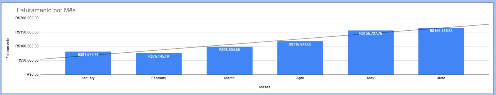
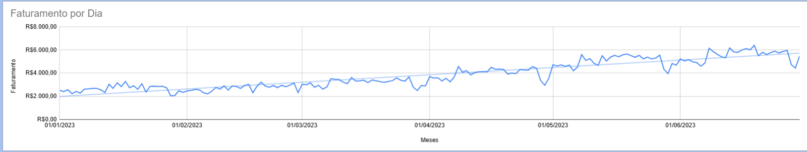
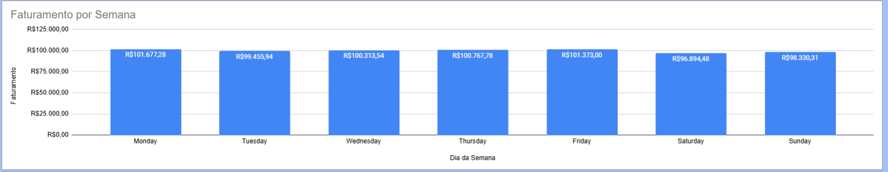
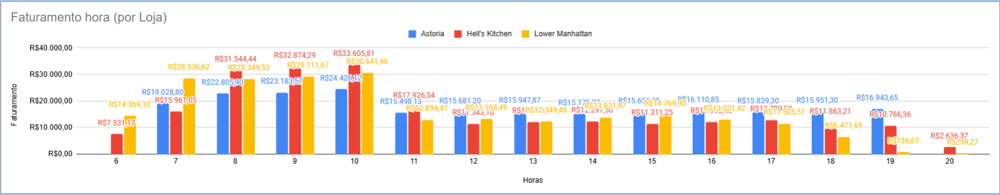
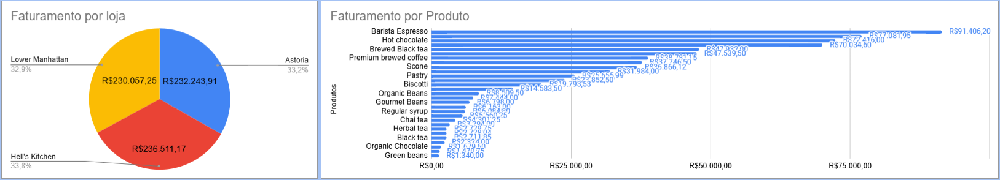
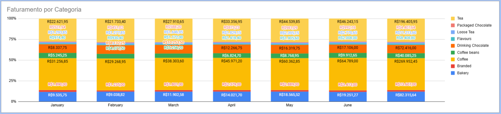

## 2. Análise Diagnóstica

Resultado da Análise Diagnostica

A cafeteria teve um crescimento total de 80% dentro do período analisado, com o mês de Fevereiro em decaimento de -6,77%											
Tendo uma forte correlação com a quantidade de pedidos, o faturamento das lojas e o tamanho do produtos que teve a performance  similar, pois crescem e decrescem na mesma proporção											
O preço unitário dos produtos teve uma correlação levemente negativa com o faturamento impactando o preço total dos pedidos fechando com -0,75%
										
Entretanto mesmo com o preço impactando de forma negativa, a quantidade de produtos por atendimento fechou com crescimento de 0,30% quanto menor o preço maior o volume de itens comprados

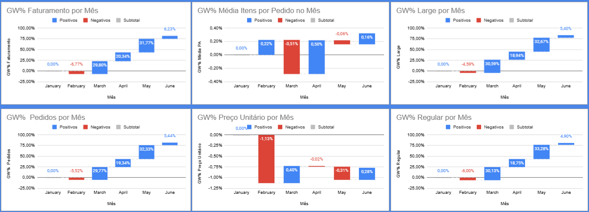
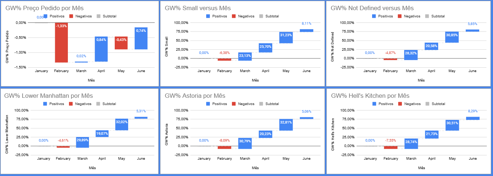

Foi utilizado a Correlação de Spearman para medir a força entre os elementos

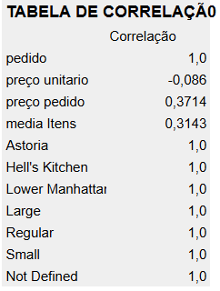									
											
## 3. Análise Preditiva

Resultado da Análise Preditiva	

A análise mostrou uma previsão de crescimento no faturamento no mês de Julho com as seguintes informações:						
Margem de Erro para o Mês de Julho  						
Erro de 8,64%						
Erro médio (por dia) de R$ 363,84 reais						
						
Previsão de Faturamento						
Julho	R$ 188.160,50	
						
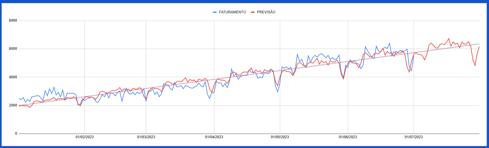			

## 4. Análise Prescritiva

Resultado da Análise Prescritiva	

O aumento de Categorias pode causar uma queda no faturamento de R$745 por dia 						
Mais Variedade de produtos é uma forma de trazer novidades para a cafeteria aumentando o faturamento em R$349 por dia					
Avaliar melhor sobre alterações no preço e testar em curtos períodos aumento ou diminuição do mesmo, pois pode trazer um prejuízo de R$1.208 por dia				
Adicionar mais produtos aos pedidos pode significar mais lucro, de até R$2.396 por dia					
		
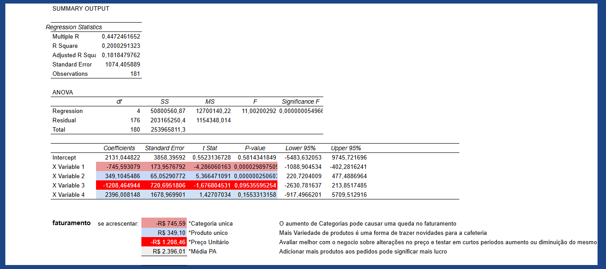			

# RESULTADO/ RECOMENDAÇÃO

- As analises mostraram que a saúde financeira esta crescendo, com picos de faturamento no começo do mês e maior volume de vendas entre 07hrs e 10hrs da manha sendo de segunda a sexta os melhores dias da semana. As 3 lojas da rede contribuem de forma igual no faturamento mesmo sendo de regiões diferentes.
Porem mostrou que no final do mês a uma queda no faturamento principalmente após o horário do almoço com o Sábado e Domingo sendo os dias mais fraco.

- As categorias que mais contribuíram foram Coffe, Tea e Drinking Chocolate dos produtos Barista Espresso, Hot Chocolate e Brewed Black Tea, mostrando uma fragilidade em relação as vendas de outras categorias que não estão performando.
A queda de preço desses produtos contribuiu para que eles vendessem grandes quantidades por pedido, diminuindo o preço médio da compra total.

- A Previsão das analises mostrou que se as lojas manterem o mesmo ritmo, o mês de julho tende a ter crescimento com as mesmas observações acima. Fechando o mês com um faturamento de 
R$188.160,50

- É recomendado a inclusão de novos produtos nas categorias já existentes principalmente as que não estão performando, assim, trazendo novidades para a cafeteria. 
Analisar cuidadosamente o preço dos produtos e observar os impactos.
Fazer promoção de combos, por exemplo, para acrescentar mais produtos aos pedidos aumentando o preço médio e o faturamento, principalmente em dias e horário de baixo fluxo.

# VISUALISE A ANALISE COMPLETA
  https://docs.google.com/spreadsheets/d/1T4K0bcLFh-bQto59gQGbVdGahSq0trFQMLQUp9p_bgk/edit?usp=sharing

# Próximos Passos
- Analisar quantos clientes novos entraram no mês e quantos dos clientes fieis fizeram uma nova compra, para criar analise de Cohort e de RFM e entender o comportamento dos clientes
